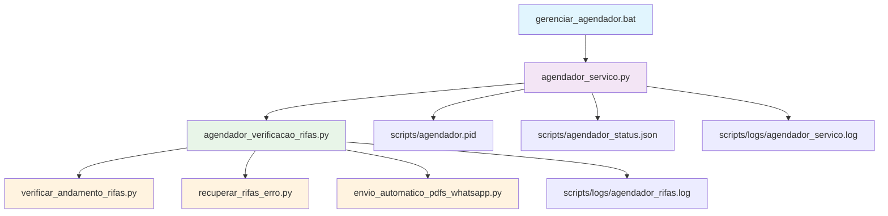

# 🔗 Diagrama de Dependências - Sistema de Agendador

## 📊 Fluxo de Dependências



## 📋 Detalhamento das Dependências

### 🎮 **Nível 1 - Interfaces de Usuário**
```
gerenciar_agendador.bat (Interface Principal)

```
**Depende de:** `agendador_servico.py`

### 🔧 **Nível 2 - Serviço Principal**
```
agendador_servico.py (Serviço em Background)
```
**Depende de:**
- `agendador_verificacao_rifas.py` (classe AgendadorRifas)
- `scripts/logs/` (diretório de logs)
- `scripts/agendador.pid` (arquivo de PID)

**Cria:**
- `scripts/agendador_status.json` (status do serviço)
- `scripts/logs/agendador_servico.log` (logs do serviço)

### 🧠 **Nível 3 - Lógica de Negócio**
```
agendador_verificacao_rifas.py (Agendador Inteligente)
```
**Depende de:**
- `verificar_andamento_rifas.py` (verificação web)
- `recuperar_rifas_erro.py` (recuperação de erros)
- `envio_automatico_pdfs_whatsapp.py` (envio de PDFs)
- `pymysql` (conexão com banco)
- `schedule` (agendamento)

**Cria:**
- `scripts/logs/agendador_rifas.log` (logs de verificação)

### 🔍 **Nível 4 - Scripts de Verificação**
```
verificar_andamento_rifas.py (Verificação Web)
recuperar_rifas_erro.py (Recuperação)
envio_automatico_pdfs_whatsapp.py (Envio PDFs)
```
**Dependem de:**
- `selenium` (automação web)
- `pymysql` (banco de dados)
- `requests` (HTTP requests)

## ⚠️ **Regras de Modificação**

### ✅ **Pode Modificar:**
- `gerenciar_agendador.bat` - Interface

- Configurações em `agendador_verificacao_rifas.py`

### 🔒 **Não Modificar (sem conhecimento):**
- `agendador_servico.py` - Estrutura principal
- `agendador_verificacao_rifas.py` - Lógica crítica
- Scripts de verificação (nível 4)

### 📝 **Antes de Modificar:**
1. **SEMPRE** leia o `README.md`
2. **SEMPRE** faça backup
3. **SEMPRE** teste em ambiente de desenvolvimento
4. **SEMPRE** verifique dependências

## 🔄 **Ordem de Inicialização**

1. **Verificar dependências Python:**
   ```bash
   pip install schedule pymysql selenium requests
   ```

2. **Verificar estrutura de pastas:**
   ```
   scripts/
   ├── agendador/
   │   ├── agendador_servico.py
   │   ├── agendador_verificacao_rifas.py
   │   └── controlador_agendador.py
   ├── logs/
   └── agendador.pid (criado automaticamente)
   ```

3. **Iniciar via interface:**
   ```bash
   gerenciar_agendador.bat
   ```

## 🚨 **Pontos de Falha**

### **Críticos:**
- ❌ `agendador_verificacao_rifas.py` não encontrado
- ❌ Banco de dados inacessível
- ❌ Chrome/Selenium não funcionando

### **Não Críticos:**
- ⚠️ Dashboard não acessível (continua funcionando)
- ⚠️ Erro de encoding no envio de PDFs
- ⚠️ Logs não criados (criados automaticamente)

## 📞 **Suporte e Manutenção**

### **Em caso de problemas:**
1. Verificar se todos os arquivos estão na pasta correta
2. Verificar se as dependências Python estão instaladas
3. Verificar logs em `scripts/logs/`
4. Reiniciar o serviço via interface

### **Para desenvolvedores:**
- Mantenha a estrutura de dependências
- Documente mudanças no README.md
- Teste todas as funcionalidades após modificações
- Use controle de versão (Git)

---

**⚠️ IMPORTANTE:** Este diagrama deve ser atualizado sempre que houver mudanças na estrutura de dependências! 